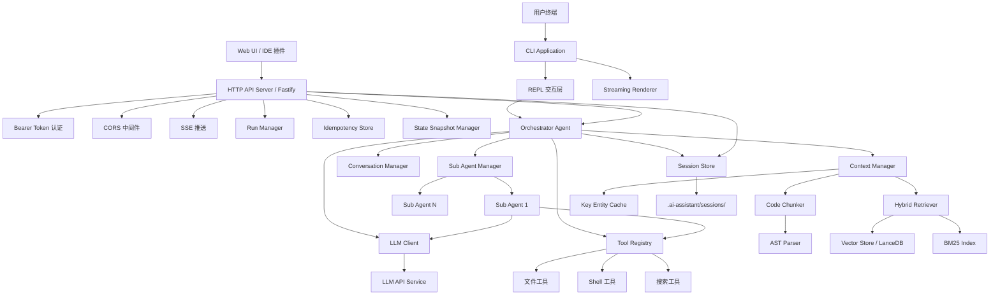

# nodejs-claude-code

基于 Node.js 的命令行 AI 编程助手，采用 Deep Agent 架构（Orchestrator + Sub Agent），通过原生 agentic loop 实现代码理解、工具调用、多轮对话与 HTTP API 服务。

## 整体架构



## 分层架构

| 层级 | 组件 |
|------|------|
| 表示层 | CLI (REPL + Streaming Renderer)、HTTP API Server (Fastify + SSE) |
| 编排层 | Orchestrator Agent、Sub Agent Manager、Conversation Manager、Run Manager |
| 能力层 | Tool Registry、File/Shell/Search Tools、LLM Client |
| 基础设施层 | Context Manager、Code Chunker、Vector Store、Hybrid Retriever、Key Entity Cache、Session Store、Idempotency Store、State Snapshot Manager |

## 核心组件

### Orchestrator Agent
实现 agentic loop 核心逻辑：组装消息 → 调用 LLM → 执行工具 → 追加结果 → 循环直到纯文本响应。支持流式输出和 Sub Agent 委派。

### LLM Client
与 LLM API 通信，支持 SSE 流式解析、tool_call 提取、指数退避重试（最多 3 次）。

### Tool Registry
工具注册、JSON Schema 参数校验与执行。内置工具：
- `file-read` / `file-write` / `file-edit` — 文件读写编辑
- `shell-execute` — Shell 命令执行
- `grep-search` — 正则代码搜索
- `list-directory` — 目录列表

### Context Manager
收集项目结构（遵循 .gitignore）、混合检索相关代码片段、组装系统提示词、压缩大型工具输出。

### Code Chunker
AST 感知语义分块：按函数/类/方法边界分块，注释与代码节点绑定，超大节点按语句级二次分割（保留 2 行重叠），附加 import 声明元数据。

### Hybrid Retriever
向量检索（余弦相似度，权重 0.7）+ BM25 关键词检索（权重 0.3）融合排序，低相似度时自动提升 BM25 权重，支持相邻 Chunk 扩展和依赖关系图补充。

### Conversation Manager
高低水位线压缩策略：token 超过高水位线（80%）时生成结构化摘要，保留关键实体、决策、错误信息，压缩至低水位线（50%）。

### HTTP API Server
基于 Fastify，提供 REST + SSE 接口，与 CLI 共享核心引擎：
- `POST /api/sessions` — 创建会话
- `POST /api/sessions/:id/agent` — 提交 Agent 请求（返回 202 + runId）
- `GET /api/sessions/:id/runs/:runId/events` — SSE 事件流
- Bearer Token 认证 + CORS 中间件

### Session Store
会话数据本地磁盘持久化（`.ai-assistant/sessions/{sessionId}.json`），支持多会话并发管理与自动过期清理（默认 30 天）。

### Run Manager
两阶段异步作业管理：202 立即返回 runId，会话内串行执行，Run 状态机（pending → running → completed/failed）。

### Idempotency Store
两层去重：已完成缓存（TTL 24h）+ 飞行中请求合并，确保重试安全。

## 技术栈

| 类别 | 技术 |
|------|------|
| 运行时 | Node.js + TypeScript |
| HTTP 框架 | Fastify |
| 向量存储 | LanceDB 或 SQLite + sqlite-vss |
| AST 解析 | tree-sitter 或 @babel/parser |
| 属性测试 | fast-check |
| 单元/集成测试 | Vitest |

## 数据持久化

| 数据 | 路径 |
|------|------|
| 向量索引 | `.ai-assistant/index/vectors.db` |
| 依赖关系图 | `.ai-assistant/index/deps.db` |
| 会话数据 | `.ai-assistant/sessions/{sessionId}.json` |
| 项目配置 | `.ai-assistant.json` |
| 全局配置 | `~/.ai-assistant/config.json` |

## 快速开始

```bash
# 安装依赖
npm install

# 配置环境变量
export LLM_API_KEY=your_api_key
export LLM_BASE_URL=https://api.anthropic.com
export LLM_MODEL=claude-3-5-sonnet-20241022

# 启动 CLI
npm start

# 启动 HTTP API 服务
npm run serve
```

## 目录结构

```
src/
├── agent/
│   ├── orchestrator.ts        # Orchestrator Agent + agentic loop
│   ├── run-manager.ts         # 两阶段作业管理
│   └── sub-agent-manager.ts   # Sub Agent 创建与执行
├── api/
│   ├── server.ts              # Fastify HTTP API Server
│   ├── middleware/            # Bearer Token 认证、CORS
│   ├── sse/                   # SSE 事件流管理
│   ├── idempotency/           # 幂等性存储
│   └── snapshot/              # 状态快照管理
├── cli/
│   ├── repl.ts                # REPL 交互循环
│   └── streaming-renderer.ts  # 流式渲染（语法高亮）
├── config/
│   └── config-manager.ts      # 配置加载与合并
├── context/
│   ├── context-manager.ts     # 上下文收集与注入
│   ├── code-chunker.ts        # AST 感知代码分块
│   ├── dependency-graph.ts    # 文件依赖关系图
│   └── key-entity-cache.ts    # 关键实体缓存
├── conversation/
│   └── manager.ts             # 对话历史与压缩
├── llm/
│   └── client.ts              # LLM API 客户端
├── retrieval/
│   ├── hybrid-retriever.ts    # 混合检索（向量 + BM25）
│   ├── vector-store.ts        # 向量存储
│   ├── bm25-index.ts          # BM25 索引
│   └── embedding-engine.ts    # 嵌入向量生成
├── session/
│   └── session-store.ts       # 会话持久化
├── tools/
│   ├── registry.ts            # 工具注册与执行
│   └── implementations/       # 各工具实现
└── types/                     # TypeScript 类型定义

tests/
├── property/                  # 属性测试（fast-check，60 个正确性属性）
├── unit/                      # 单元测试
└── integration/               # 集成测试
```

## 测试

```bash
# 运行属性测试
npx vitest run tests/property

# 运行单元测试
npx vitest run tests/unit
```
